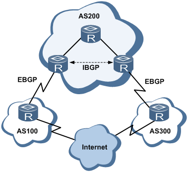
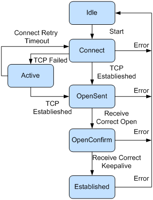
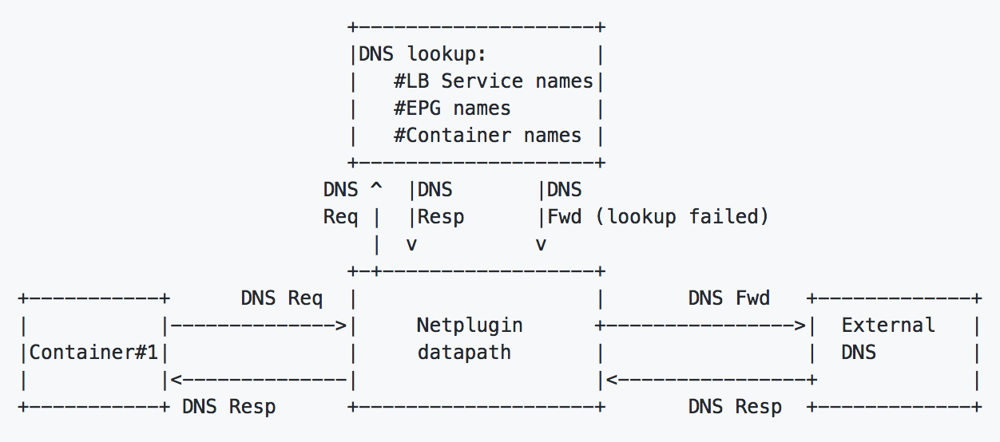
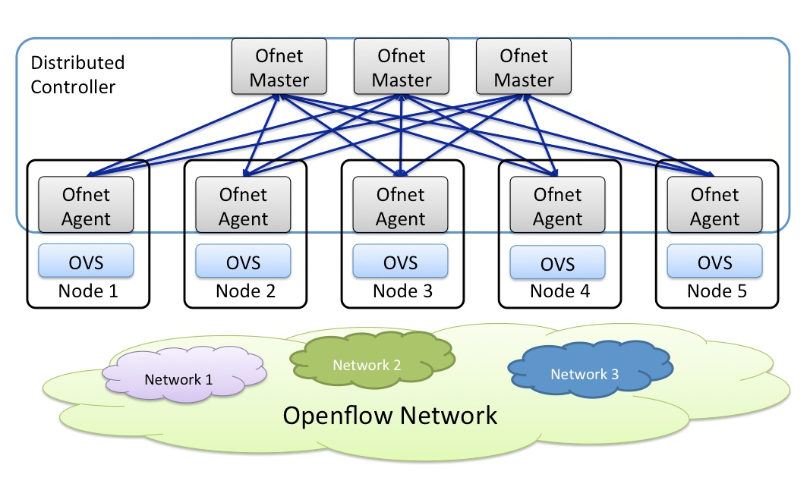
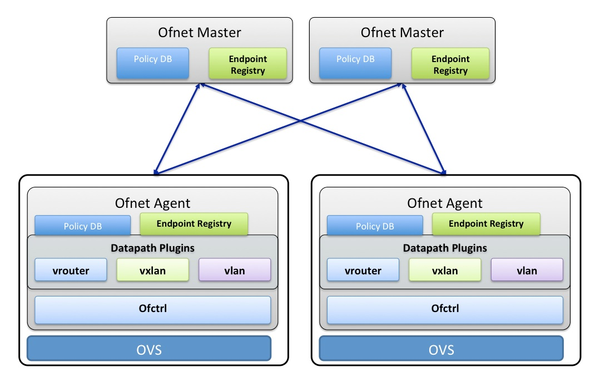

<!-- START doctoc generated TOC please keep comment here to allow auto update -->
<!-- DON'T EDIT THIS SECTION, INSTEAD RE-RUN doctoc TO UPDATE -->
**Table of Contents**  *generated with [DocToc](https://github.com/thlorenz/doctoc)*

- [BGP Concepts](#bgp-concepts)
  - [ACI](#aci)
  - [自治系统AS（Autonomous System）](#%E8%87%AA%E6%B2%BB%E7%B3%BB%E7%BB%9Fasautonomous-system)
  - [BGP 概述](#bgp-%E6%A6%82%E8%BF%B0)
  - [BGP 分类](#bgp-%E5%88%86%E7%B1%BB)
  - [BGP报文交互中的角色](#bgp%E6%8A%A5%E6%96%87%E4%BA%A4%E4%BA%92%E4%B8%AD%E7%9A%84%E8%A7%92%E8%89%B2)
  - [BGP的路由器号（Router ID）](#bgp%E7%9A%84%E8%B7%AF%E7%94%B1%E5%99%A8%E5%8F%B7router-id)
  - [BGP工作原理](#bgp%E5%B7%A5%E4%BD%9C%E5%8E%9F%E7%90%86)
    - [BGP报文](#bgp%E6%8A%A5%E6%96%87)
    - [BGP状态机](#bgp%E7%8A%B6%E6%80%81%E6%9C%BA)
    - [BGP对等体之间的交互原则](#bgp%E5%AF%B9%E7%AD%89%E4%BD%93%E4%B9%8B%E9%97%B4%E7%9A%84%E4%BA%A4%E4%BA%92%E5%8E%9F%E5%88%99)
    - [BGP引入IGP路由](#bgp%E5%BC%95%E5%85%A5igp%E8%B7%AF%E7%94%B1)
- [Concepts](#concepts)
  - [Groups](#groups)
  - [Policies](#policies)
  - [Network](#network)
    - [Networks in Contiv](#networks-in-contiv)
    - [Network Encapsulation](#network-encapsulation)
  - [Tenant](#tenant)
- [Contiv Object Model](#contiv-object-model)
- [Domain Name Server（DNS）](#domain-name-serverdns)
- [Contiv Binaries](#contiv-binaries)
- [Ofnet](#ofnet)
  - [High level Architecture](#high-level-architecture)
  - [Multiple datapath plugins](#multiple-datapath-plugins)
- [References](#references)

<!-- END doctoc generated TOC please keep comment here to allow auto update -->

# BGP Concepts

ACI: Cisco Application Centric Infrastructure
BGP: Border Gateway Protocol
AS: Autonomous Systems

## ACI

ACI, the industry leading software defined networking (SDN) solution enables application agility and data center automation. Customers can build multi-cloud networks with a consistent policy model. With ACI Anywhere, customers have the flexibility to move applications seamlessly without compromising high availability and creating a single fault domain environment.

## 自治系统AS（Autonomous System）

AS是指在一个实体管辖下的拥有相同选路策略的IP网络。BGP网络中的每个AS都被分配一个唯一的AS号，用于区分不同的AS。

AS号分为2字节AS号和4字节AS号，其中2字节AS号的范围为1至65535，4字节AS号的范围为1至4294967295。支持4字节AS号的设备能够与支持2字节AS号的设备兼容。

## BGP 概述

边界网关协议 BGP（Border Gateway Protocol）是一种实现自治系统 AS（Autonomous System）之间的路由可达，并选择最佳路由的距离矢量路由协议。BGP 能够进行路由优选、避免路由环路、更高效率的传递路由和维护大量的路由信息。

BGP 用于在不同的自治系统（AS）之间交换路由信息。当两个 AS 需要交换路由信息时，每个 AS 都必须指定一个运行 BGP 的节点，来代表 AS 与其他的 AS 交换路由信息。这个节点可以是一个主机。但通常是路由器来执行 BGP。

由于可能与不同的AS相连，在一个AS内部可能存在多个运行BGP的边界路由器。同一个自治系统(AS)中的两个或多个对等实体之间运行的BGP 被称为 IBGP（Internal/Interior BGP）。归属不同的AS的对等实体之间运行的BGP称为EBGP （External/Exterior BGP）。在AS边界上与其他AS交换信息的路由器被称作边界路由器(border/edge router)。

## BGP 分类

如上图1所示，BGP按照运行方式分为EBGP（External/Exterior BGP）和IBGP（Internal/Interior BGP）。

1、EBGP：

运行于不同AS之间的BGP称为EBGP。为了防止AS间产生环路，当BGP设备接收EBGP对等体发送的路由时，会将带有本地AS号的路由丢弃。

2、IBGP：

运行于同一AS内部的BGP称为IBGP。为了防止AS内产生环路，BGP设备不将从IBGP对等体学到的路由通告给其他IBGP对等体，并与所有IBGP对等体建立全连接。为了解决IBGP对等体的连接数量太多的问题，BGP设计了路由反射器和BGP联盟（详情见后面）。

如果在AS内一台BGP设备收到EBGP邻居发送的路由后，需要通过另一台BGP设备将该路由传输给其他AS，此时推荐使用IBGP。

## BGP报文交互中的角色

BGP报文交互中分为Speaker和Peer两种角色。

1、Speaker：

发送BGP报文的设备称为BGP发言者（Speaker），它接收或产生新的报文信息，并发布（Advertise）给其它BGP Speaker。

2、Peer：

相互交换报文的Speaker之间互称对等体（Peer）。若干相关的对等体可以构成对等体组（Peer Group）。

## BGP的路由器号（Router ID）

BGP的Router ID 是一个用于标识BGP设备的32位值，通常是IPv4地址的形式，在BGP会话建立时发送的Open报文中携带。

对等体之间建立BGP会话时，每个BGP设备都必须有唯一的Router ID，否则对等体之间不能建立BGP连接。

BGP的Router ID在BGP网络中必须是唯一的，可以采用手工配置，也可以让设备自动选取。

缺省情况下，BGP选择设备上的Loopback接口的IPv4地址作为BGP的Router ID。如果设备上没有配置Loopback接口，系统会选择接口中最大的IPv4地址作为BGP的Router ID。一旦选出Router ID，除非发生接口地址删除等事件，否则即使配置了更大的地址，也保持原来的Router ID。

## BGP工作原理

BGP对等体的建立、更新和删除等交互过程主要有5种报文、6种状态机和5个原则。

### BGP报文

BGP对等体间通过以下5种报文进行交互，其中Keepalive报文为周期性发送，其余报文为触发式发送：

- Open报文：

用于建立BGP对等体连接。

- Update报文：

用于在对等体之间交换路由信息。

- Notification（通告）报文：

用于中断BGP连接。

- Keepalive报文：

用于保持BGP连接。

- Route-refresh（刷新）报文：

用于在改变路由策略后请求对等体重新发送路由信息。只有支持路由刷新（Route-refresh）能力的BGP设备会发送和响应此报文。

### BGP状态机

如上图1所示，BGP对等体的交互过程中存在6种状态机：空闲（Idle）、连接（Connect）、活跃（Active）、Open报文已发送（OpenSent）、Open报文已确认（OpenConfirm）和连接已建立（Established）。在BGP对等体建立的过程中，通常可见的3个状态是：Idle、Active和Established。

- Idle状态是BGP初始状态。

在Idle状态下，BGP拒绝邻居发送的连接请求。只有在收到本设备的Start事件后，BGP才开始尝试和其它BGP对等体进行TCP连接，并转至Connect（连接）状态。

Start事件是由一个操作者配置一个BGP过程，或者重置一个已经存在的过程或者路由器软件重置BGP过程引起的。

任何状态中收到Notification（通告）报文或TCP拆链通知等Error事件后，BGP都会转至Idle状态。

- 在Connect（连接）状态下，BGP启动连接重传定时器（Connect Retry），等待TCP完成连接。

如果TCP连接成功，那么BGP向对等体发送Open报文，并转至OpenSent状态。

如果TCP连接失败，那么BGP转至Active（活跃）状态。

如果连接重传定时器超时，BGP仍没有收到BGP对等体的响应，那么BGP继续尝试和其它BGP对等体进行TCP连接，停留在Connect状态。

- 在Active状态下，BGP总是在试图建立TCP连接。

如果TCP连接成功，那么BGP向对等体发送Open报文，关闭连接重传定时器，并转至OpenSent状态。

如果TCP连接失败，那么BGP停留在Active状态。

如果连接重传定时器超时，BGP仍没有收到BGP对等体的响应，那么BGP转至Connect状态。

- 在OpenSent状态下，BGP等待对等体的Open报文，并对收到的Open报文中的AS号、版本号、认证码等进行检查。

如果收到的Open报文正确，那么BGP发送Keepalive报文，并转至OpenConfirm状态。

如果发现收到的Open报文有错误，那么BGP发送Notification报文给对等体，并转至Idle状态。

- 在OpenConfirm状态下，BGP等待Keepalive或Notification报文。如果收到Keepalive报文，则转至Established状态，如果收到Notification报文，则转至Idle状态。

- 在Established状态下，BGP可以和对等体交换Update、Keepalive、Route-refresh报文和Notification报文。

如果收到正确的Update或Keepalive报文，那么BGP就认为对端处于正常运行状态，将保持BGP连接。

如果收到错误的Update或Keepalive报文，那么BGP发送Notification报文通知对端，并转至Idle状态。

Route-refresh报文不会改变BGP状态。

如果收到Notification报文，那么BGP转至Idle状态。

如果收到TCP拆链通知，那么BGP断开连接，转至Idle状态。

### BGP对等体之间的交互原则

BGP设备将最优路由加入BGP路由表，形成BGP路由。BGP设备与对等体建立邻居关系后，采取以下交互原则：

- 从IBGP对等体获得的BGP路由，BGP设备只发布给它的EBGP对等体。

- 从EBGP对等体获得的BGP路由，BGP设备发布给它所有EBGP和IBGP对等体。

- 当存在多条到达同一目的地址的有效路由时，BGP设备只将最优路由发布给对等体。

- 路由更新时，BGP设备只发送更新的BGP路由。

- 所有对等体发送的路由，BGP设备都会接收。

### BGP引入IGP路由

BGP与IGP在设备中使用不同的路由表，为了实现不同AS间相互通讯，BGP需要与IGP进行交互，即BGP路由表和IGP路由表相互引入。

BGP协议本身不发现路由，因此需要将其他路由引入到BGP路由表，实现AS间的路由互通。

当一个AS需要将路由发布给其他AS时，AS边缘路由器会在BGP路由表中引入IGP的路由。为了更好的规划网络，BGP在引入IGP的路由时，可以使用路由策略进行路由过滤和路由属性设置，也可以设置MED值指导EBGP对等体判断流量进入AS时选路。

BGP引入路由时支持Import和Network两种方式：

- Import方式是按协议类型，将RIP、OSPF、ISIS等协议的路由引入到BGP路由表中。为了保证引入的IGP路由的有效性，Import方式还可以引入静态路由和直连路由。

- Network方式是逐条将IP路由表中已经存在的路由引入到BGP路由表中，比Import方式更精确。

# Concepts

Container networking with Contiv is as easy as creating networks and assigning containers to the networks. The advantage of Contiv is that you can apply policies to govern the security, bandwidth, priority, and other parameters for container applications.

## Groups

A group (or an application group) identifies a policy domain for a container or a pod. The grouping is an arbitrary collection of containers that share a specific application domain, for example all production,frontend containers, or backup,long-running containers. This association is often done by specifying a label for the group.

Most notably, an application group or tier in Contiv has no one-to-one mapping to a network or an IP subnet of a network. This encourages you to group applications based on their roles and functions, and have many application groups belong to one network or an IP subnet.

## Policies

A policy describes an operational behavior on a group of containers. The operational behavior can be enforcement, allocation, prioritation, traffic redirection, stats collection, or other action on the group on which the policy is applied.

Contiv supports two types of policies:

- Bandwidth - limiting the overall resource use of a group
- Isolation - limiting the access of a group

A group can be associated with more than one policy and in this case all policies are applied to the group. For example, a bandwidth policy could specify a limit on bandwidth consumption, while an isolation policy specifies from which addresses the container can be accessed. When a container is scheduled in this group, both policies are applied to it.

Policies follow the container independent of where it is scheduled. Therefore, policy is specified for a given cluster, but enforcement done on the host where container is scheduled.

## Network

Network is an IPv4 or IPv6 subnet that may be provided with a default gateway. For example, a network can map to a subnet 10.1.1.0/24 that has a default gateway of 10.1.1.1.

Application developers usually don't care which network an application belongs to. The network association of an application becomes relevant when the application must be exposed to an external network, to allow non-container workloads or clients to communicate with it.

### Networks in Contiv

Contiv allows you to define two types of networks:

- application network - Network used by container workloads
- infrastructure network - Create a virtual network in the host namespace. For example, infrastructure networks are used by the virtual layer of host-resident infrastructure services such as monitoring.

### Network Encapsulation

There are two types of network encapsulation in Contiv:

- Routed - useful for overlay topology and L3-routed BGP topology
- Bridged - useful for connecting to a layer2 VLAN network

## Tenant
Tenants provide the namespace isolation for Contiv. A tenant can have many networks, each with its own subnet address. A user within that tenant namespace can create networks with arbtrary subnet addresses, and re-use subnet IP addresses in other tenants.

A tenant in the physical network is called virtual routing and forwarding (VRF). Depending on the mode of external connectivity (layer2, layer3, or Cisco ACI), the Contiv forwarding layer communicates the tenant to the external network using a VLAN or VXLAN ID. The Contiv routing plane (like BGP) is used to communicate the VRF-ID to rest of the network.

# Contiv Object Model

contiv endpoint 跟 k8s pod 是一一对应关系

# Domain Name Server（DNS）

- netplugin implements inline DNS in datapath.
- There are no configurations specific to DNS

Inline DNS caches the following information

- Load balancer service names
- Endpoint group names
- container names

Packetflow

- netplugin data path receives DNS msg from container
- netplugin looks up the name in local cache
- if there is any entry, DNS response is sent out
- if there is no entry then the original DNS request is forwarded

# Contiv Binaries

- netplugin and netmaster are main binaries which are part of contiv networking.
- netctl is command line utinlity you will need to talk to netmaster.

# Ofnet

Ofnet is a networking library that manages a network of openflow switches using a distributed controller architecture

Ofnet is a golang library that can be used by Container network drivers or container executors to manage a cluster wide network. Ofnet implements openflow 1.3 based controller and works with OpenVswitch. Ofnet manages only the openflow forwarding aspect of OVS. It does not create OVS interfaces/ports required by containers. It is assumed that container network driver creates OVS interface, moves it to container namespace and passes endpoint information to Ofnet library using its API.

Ofnet Controller supports multiple Software Defined Networking paradigms. They are

  1. **vrouter**
    - In this mode entire network operates like a giant router. IP packates are forwarded based on their IP dest address using a Vxlan overlay. Ofnet controller keeps track of all IP addresses in the network and programs OVS to lookup IP destination address and forward it using the overlay. It Proxies all ARP requests so that there is no need for broadcast in the network.
  2. **vxlan bridge**
    - In this mode each OVS acts as a VXLAN switch and together they emulate multiple bridge domains. This mode requires OVS 2.3.1 or higher.
  3. **vlan bridge**
    - In this mode OVS acts as a VLAN bridge
  4. **vlan router**
    - In this mode OVS acts as an IP Router. Control plane protocol like BGP is used to exchange routing information with physical switches

## High level Architecture

As shown above Ofnet Controller consists of Ofnet Agents that run on each host along with OVS and multiple Ofnet Masters. Ofnet agents can connect to any number of Ofnet Masters. Ofnet Masters largely act as state distributors. Ofnet Masters and Agents form an eventually consistent database that can survive multiple node failures, network partitioning and temporary hiccups. Controller state is guaranteed to eventually reach a consistent state.

Ofnet controller supports the concept of multiple networks. Depending on the forwarding paradign, this can be mapped to Tenats(VRF in networking lingo, VPC in cloud lingo), Subnets or bridge domains.

## Multiple datapath plugins

Ofnet Controller supports multiple data path plugins. Currently vrouter and vxlan plugins are implemented. Vlan plugin is in development. These plugins use Ofctrl library to program Flows in OVS. Please see Ofctrl subdirectory on more details.

# References

1. http://contiv.github.io/documents/networking/concepts.html
2. https://github.com/contiv/ofnet
3. http://contiv.github.io/documents
4. http://contiv.github.io/documents/networking/services.html
5. http://contiv.github.io/documents/networking/policies.html
6. http://contiv.github.io/documents/networking/ipam.html
7. http://contiv.github.io/documents/networking/l2-vlan.html
8. http://contiv.github.io/documents/networking/bgp.html
