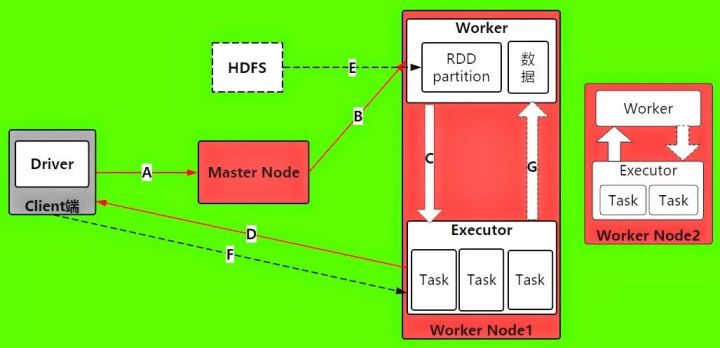
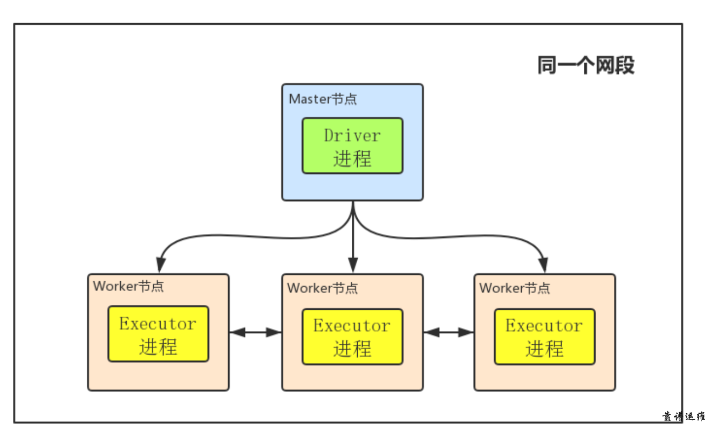
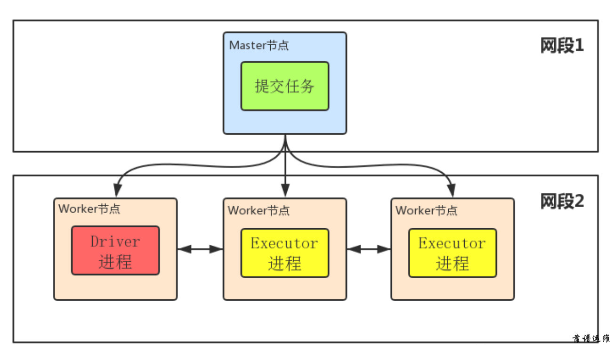
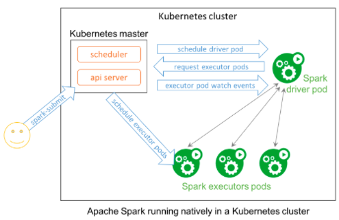

# spark 介绍

## 基本概念

- Spark 集群：分为 `Master 节点` 和 `Worker 节点`。
- Client：客户端进程，负责提交作业到 Master。
- Application：指的是用户编写的 Spark 应用程序，包含了一个 Driver 功能的代码和分布在集群中多个节点上运行的 Executor 代码。
- Cluster Manager：指的是获取集群资源的服务，目前有：
  - Standalone：Spark 原生的资源管理，由 Master 负责资源的分配
  - Hadoop Yarn：由 YARN 中的 ResourceManager 负责资源的分配
- Master：Standalone 模式中主控节点，负责接收 Client 提交的作业，管理 Worker，并命令 Worker 启动 Driver 和 Executor。
- Worker：集群中任何可以运行 Application 代码的节点。在 Standalone 模式中指的就是通过 Slave 文件配置的 Worker 节点，在 Spark on Yarn 模式中指的就是 NodeManager 节点，负责管理本节点的资源，定期向 Master 汇报心跳，接收 Master 的命令，启动 Driver 和 Executor。
- Driver： 一个 Spark 作业运行时包括一个 Driver 进程，也是作业的主进程，负责作业的解析、生成 Stage 并调度 Task 到 Executor 上。包括 DAGScheduler，TaskScheduler。
- Executor：即真正执行作业的地方，一个集群一般包含多个 Executor，每个 Executor 接收 Driver 的命令 Launch Task，一个 Executor 可以执行一到多个 Task。
- 作业（Job）：包含多个 Task 组成的并行计算，往往由 Spark Action 催生，一个 JOB 包含多个 RDD 及作用于相应 RDD 上的各种 Operation。
- Stage：一个 Spark 作业一般包含一到多个 Stage。
- Task：一个 Stage 包含一到多个 Task，通过多个 Task 实现并行运行的功能。
- DAGScheduler： 实现将 Spark 作业分解成一到多个 Stage，每个 Stage 根据 RDD 的 Partition 个数决定 Task 的个数，然后生成相应的 Task set 放到 TaskScheduler 中。
- TaskScheduler：实现 Task 分配到 Executor 上执行。

## 架构原理



- A，每当 Driver 进程被启动之后，都会做哪些事情来初始化操作呢？首先它将发送请求到 Master 上，进行 Spark 应用程序的注册，也就是我们要让 Master 知道，现在有一个新的 Spark 应用程序要运行了。

- B，那 Master 在接收到 Spark 应用程序的注册申请之后，会发送给 Worker，让其进行资源的调度和分配。这也说明资源分配是由 executor 来分配管理。

- C，Worter 接收 Master 的请求之后，会为 Spark 应用启动 Executor，来给分配资源。

- D，Executor 启动分配资源好后，就会向 Driver 进行反注册，这也 Driver 就会知道哪些 Executor 是为他进行服务的了。

- E，当 Driver 得到注册了 Executor 之后，就可以开启正式执行我们的 Spark 应用程序了。首先第一步，就是创建初始 RDD，读取数据源，再执行之后的一系列算子。HDFS 文件内容被读取到多个 worker 节点上，形成内存中的分布式数据集，也就是初始 RDD。

- F，这时候，Driver 就会根据 Job 任务中的算子形成对应的 task，最后提交给 Executor，来分配 task 进行计算的线程。

- G，这时的 task 就会去调用对应自己任务的数据(也就是第一步初始化 RDD 的 partition)来计算，并且 task 会对调用过来的 RDD 的 partition 数据执行指定的算子操作，形成新的 RDD 的 partition，这时一个大的循环就结束了。


## spark client mode vs cluster mode

### spark-submit 参数

```
./bin/spark-submit \
  --class <main-class>
  --master <master-url> \
  --deploy-mode <deploy-mode> \
  --conf <key>=<value> \
  ... # other options
  <application-jar> \
  [application-arguments]
```

- --class: 你的应用的启动类 (如 org.apache.spark.examples.SparkPi)
- --master: 集群的master URL (如 spark://23.195.26.187:7077)
- --deploy-mode: 是否发布你的驱动到 worker 节点(cluster) 或者作为一个本地客户端 (client) (default: client)*
- --conf: 任意的Spark配置属性， 格式key=value. 如果值包含空格，可以加引号“key=value”.
- application-jar: 打包好的应用 jar,包含依赖. 这个URL在集群中全局可见。 比如 hdfs:// 共享存储系统， 如果是 file:// path， 那么所有的节点的 path 都包含同样的 jar.
- application-arguments: 传给 main() 方法的参数

### client mode



### cluster mode



## spark on k8s

### 结合 spark-submit

spark-submit 命令行工具用来提交 spark job 到各种 resource manager 上运行，比如：mesos、yarn、k8s。

以下是一个典型的提交 Spark 作业到 K8S 集群的命令。

```
./spark-submit
--master  k8s://https://  
--deploy-mode cluster \
--name spark-pi \
--class org.apache.spark.examples.SparkPi \
--conf spark.kubernetes.namespace=spark \
--conf spark.kubernetes.authenticate.driver.serviceAccountName=spark-sa \
--conf spark.executor.instances=2 \
--conf spark.kubernetes.container.image.pullPolicy=Always \
--conf spark.kubernetes.container.image=lightbend/spark:2.0.1-OpenShift-2.4.0-rh \
local:///opt/spark/examples/jars/spark-examples_2.11-2.4.0.jar
```

在 Client 模式，spark-submit 直接将 Spark 作业通过 Spark 环境变量初始化了，这意味着，Spark 的 Driver 运行在了 spark-submit 端，而 Spark 的 Executor 运行在 K8S 集群上。

在 Cluster 模式，spark-submit 通过 k8s 创建 driver pod，然后 driver pod 创建相关的 executor pod 运行 spark 任务：



- Spark在Kubernetes Pod中创建Spark Driver
- Driver调用Kubernetes API创建ExecutorPods，Executor Pods执行作业代码
- 计算作业结束，Executor Pods回收并清理
- Driver Pod处于completed状态，保留日志，直到Kubernetes GC或者手动清理

Spark 原生支持 Kubernetes 最大的好处是，不用在 Kubernetes 集群上再建立一层资源调度系统，只要建立一个新 Spark 容器镜像，并指派合适的 RBAC 权限角色给所要执行的 Spark 应用程序，就可以在 Kubernetes 集群上运行 Spark 程序了。

### spark operator


作业通过 kubectl/sparkctl 提交到 K8S 的 API server，custom controller 就会将这个文件转化为 CRD 对象，也就是 SparkApplication 或者 ScheduledSparkApplication。

然后 `submission runner` 从 CRD 对象中取出配置选项封装成一个 spark-submit 请求提交到 apiserver。

后面的事情就跟通过 spark-submit 脚本提交请求到 k8s 一样，创建 Driver Pod 以及 Executor Pod。

# 参考

- https://www.lightbend.com/blog/how-to-manage-monitor-spark-on-kubernetes-introduction-spark-submit-kubernetes-operator
